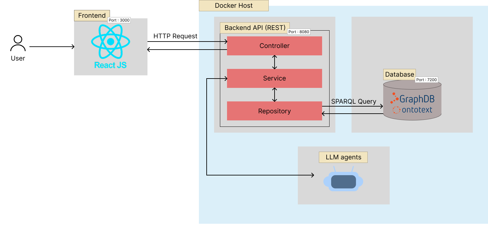

# Intent Frontend
This frontend application provides a simple interface to interact with and test the API from the [intent-back repository](https://github.com/baptisterambour/intent-back).

It is designed primarily as a test tool to explore the API endpoints, send requests, and view responses in a user-friendly way.

## Architecture



## Getting Started

### Installation

```bash
git clone https://github.com/baptisterambour/intent-front.git
cd intent-front
npm install
```

### Running the Frontend

```bash
npm start
```

This will launch the frontend app and open it in your default browser (usually at http://localhost:3000).